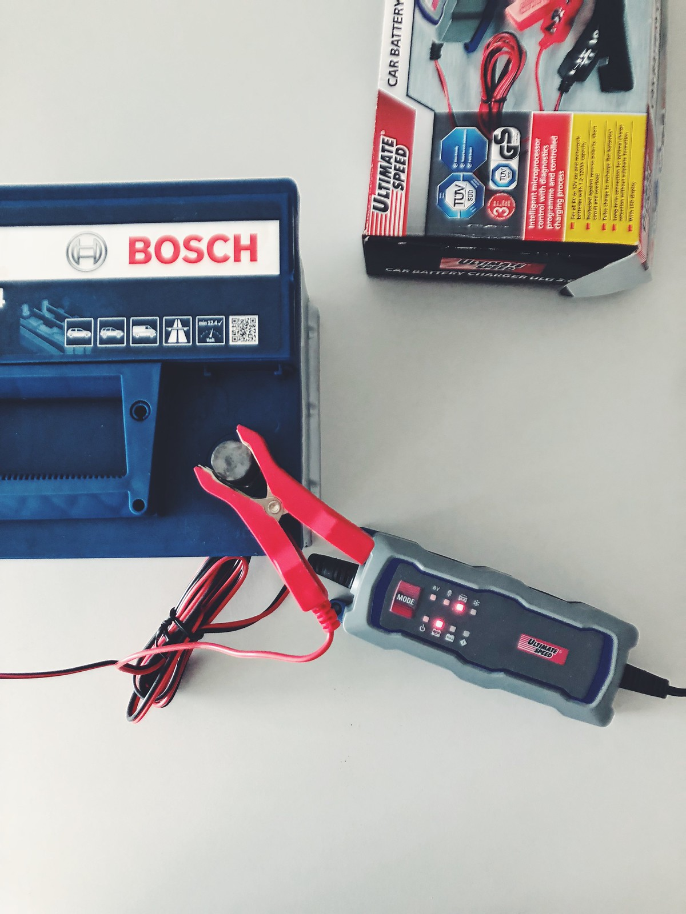
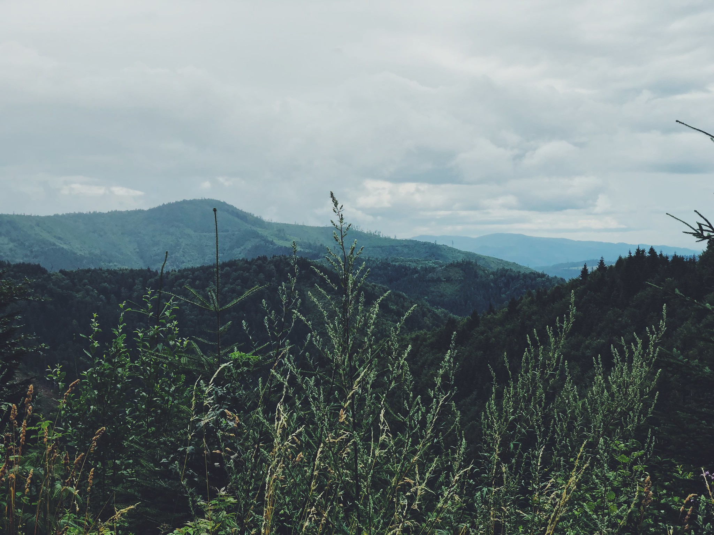
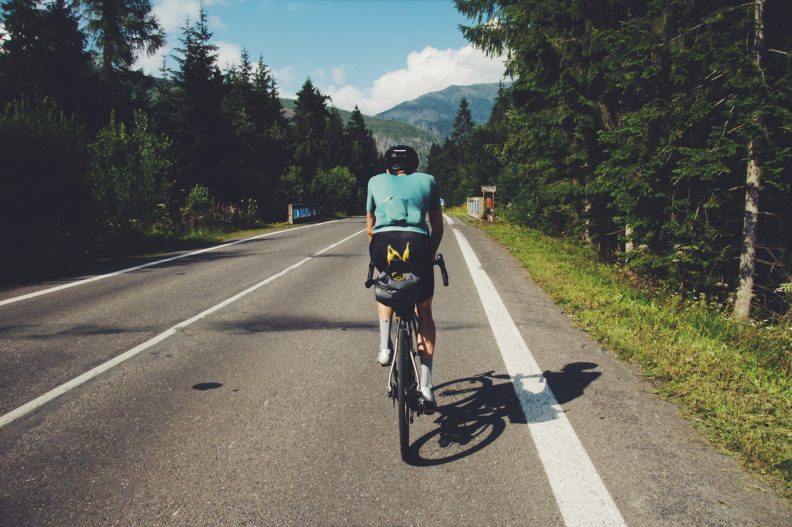
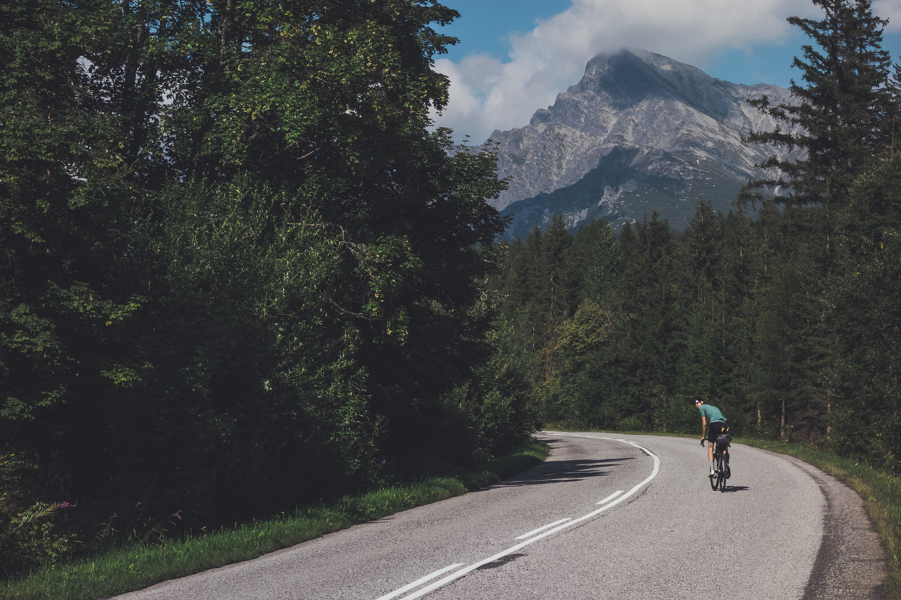

This ride is not competitive, nor the longest, but one inspired by a growing community of bikepackers and randonneurs whose stories we read in Far Ride magazine. They share their passion and love for cycling through pictures and words from all around the world, trying to get people out there to explore, travel, create <a href="https://www.instagram.com/explore/tags/cyclingmemories/">#cyclingmemories</a>, share it with friends or strangers and keep the pedals turning in the hope of a really, really good ride. We felt like we want to do something similar and our first trip was born.

We will ride over and around the <a href="https://en.wikipedia.org/wiki/Tatra_Mountains">Tatra Mountains</a> and the lesser known <a href="https://en.wikipedia.org/wiki/Low_Tatras">Low Tatras</a>. They are both part of the Carpathian Mountains and our national heritage as the highest mountains in Slovakia. The roads we chose will remind us of our childhood, bring up memories of summers spent with families but also take us to places we never visited before. 

The planning started months ago and it has been a long one to get to the beginning of our course.  Pick and buy bike bags. Plan routes. Luckily we are supported by Velits brothers from Isadore apparel with cycling gear so this one was easy to tick off the to-do list. First cancelled due to lack of accommodation in The Tatras as summer holidays started and parents take their kids to mountains, second time cancelled due to sickness so here we are trying our luck for the third time. Got over last petty Murphy’s law misfortunes, charged the car battery after leaving the interior lights on overnight, swapped cracked carbon handlebars and hit the road north.

<image-zoom></image-zoom>
<image-zoom></image-zoom>

**From Lows to Highs**

We wake up later than planned therefore cutting our first day short. This is because even on the third attempt at this micro adventure of ours, we did not manage to fully recover from sickness. Eva is still a bit sick but she is determined to slay the Tatras and I am determined to help her on our ride as much as I can, carrying the heavier load and leading the way at all times. 

We repack again, probably for the third time now. It’s only four days in the end so we are taking only the most important bits of our kits, gear and plenty of food.  Until now we tried to restrain from getting too excited. It is a first bikepacking trip for the both of us, first as a couple and first as <a href="https://www.instagram.com/coupleoftitans/">Couple of Titans</a>. (Thats why you're here hh)

As we get to the train station to catch our train, a lady at the counter tells us the train service between Zvolen and Sliac which is only around 6km is being replaced by a shuttle bus and they won’t allow us on it with our bikes. We get our train tickets and decide to beat the bus to the train in Sliac. That would be easy if I didn’t leave my Garmin at my parent's place. It’s a stressful start but my mum is quick to drive to the train station and bring it to us so we can make it to Sliac in time and hop on the train to the beginning of our ride in Low Tatras.

<image-zoom></image-zoom>
<image-zoom></image-zoom>

Shortly after we depart in Podbrezova we start climbing to make our way towards the <marker-link lat='48.905690' lng='19.735882' label='A' zoom='16'>Čertovica pass</marker-link> that divides the range into two parts. As we ride in the valley we have both the highest mountain in the range Ďumbier and the second highest mountain Chopok in our sight. The valley that leads to the pass is a gentle climb for the first 14km and the steeper part is 11,5km long climb at an average 5% grade. When we reach the top of the road we are rewarded with an amazing view of The Tatras. After first 25km we gained around 800m in elevation and are ready to descend down into Liptov area which is arguably one of the most beautiful parts of Slovakia surrounded by the High Tatras from the north and the Low Tatras from the south.

<image-zoom caption="rainy view from Čertovica climb"></image-zoom>

<image-zoom caption="backroads nav doble check, never trust komoot completely"></image-zoom>

<image-zoom caption="crossing the Belá river"></image-zoom>

<image-zoom caption="old beauty"></image-zoom>

We try to avoid main roads so instead, we ride through fields, farms and small villages trying to rest our legs a bit on a relatively flat part traversing the valley to our second climb of the day. Once we get to Podbanské we stop at a tiny shop where I used to buy gummy bears almost every summer as a kid. This marks the start of the 30km long climb up to our accommodation in Starý Smokovec which lays in 1230m above the sea level.

<image-zoom caption="🍌 packing"></image-zoom>

<image-zoom caption="Podbanské"></image-zoom>

**Up into High Tatras**

The Tatras form a natural border between Slovakia and Poland and it is the highest mountain range in the Carpathian Mountains. On our journey, we will ride the length of it which is around 80km along the main ridge from the village of Huty at the western end to the village of Ždiar at the eastern end.

<image-zoom caption="Huty"></image-zoom>

<image-zoom caption="Kriváň"></image-zoom>

We arrive at our accommodation in time for the dinner and well-deserved sleep after riding 100km and gaining around 1600m in elevation.

# Day one stories

If you've come this far reading, there are <a href="https://www.instagram.com/stories/highlights/17887212055242465/">highlights and short fragments of the day one</a> on our <a href="https://www.instagram.com/coupleoftitans/">CoT instagram</a>

or continue reading about <a href="/rides/around-tatras-2">Around Tatras Day Two</a>.