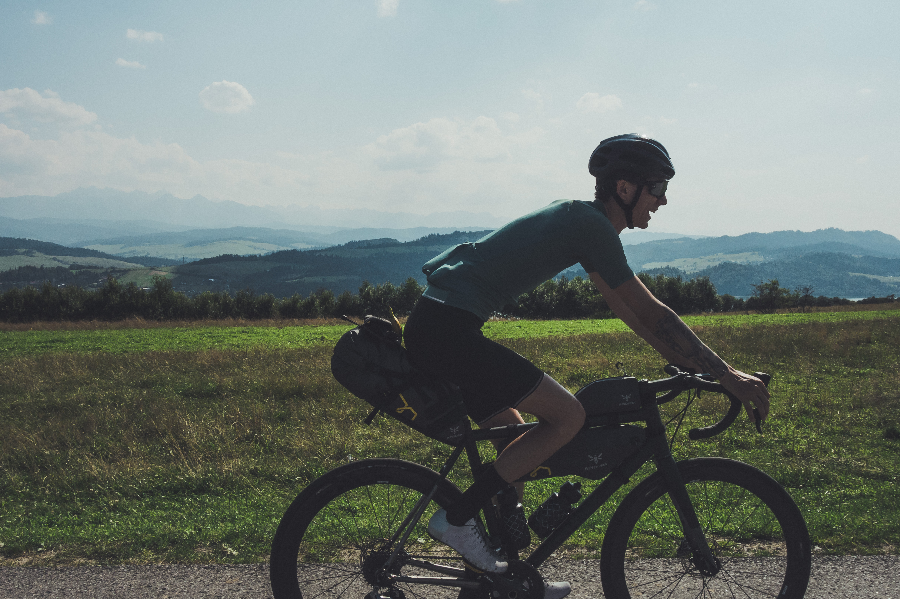

**Crossing the border**

A morning without coffee brewed by our hands is a little dramatic and even more so when we see the dark clouds looming over the mountains above us. Fortunately, the peaks act as a wall and keep the clouds on the Polish side so we leave with the sun shining on us. 

<image-zoom caption="bad and expensive coffee, but you gotta do what you gotta do"></image-zoom>

<image-zoom caption="Novy Smokovec Grand Hotel"></image-zoom>

For today we planned a 110k long ride with 1500m of elevation. As we ride downhill for the first 17km along the Tatras the traffic gets much heavier than yesterday. Now we are entering the unknown territory for us. Both of us feel a little ashamed that we've never visited <a href="https://en.wikipedia.org/wiki/Belianske_Tatras">Belianske Tatras</a> which is part of the Eastern Tatras. It’s Saturday and there are lots of Polish and Slovak tourists so our decision not to ride to <marker-link lat='49.270943' lng='20.273119' label='A' zoom='16'>Ždiar</marker-link> village but instead through the <a href="https://en.wikipedia.org/wiki/Pieniny">Pieniny</a> and the more rural parts of Spiš seems great. 

<image-zoom caption="baa"></image-zoom>

Rolling hills of Spiš are much different to the Alpine landscape of the Tatras and there is much more life in the villages and on the fields. First horse carriages and then a group of sheep in the middle of the road give us a glimpse of what to expect for next 40km. As we approach the sheep they retreat to safety knowing people and especially cyclist are not to be played with. But straight after we are through they are back on the road as the cars approach. Cars don’t seem to bother them, little they know cars can carry more people than bicycles. We love the action and stop to take some Instagram stories when the shepherd appears from the bushes chasing the sheep of the road and cursing them. It is much to our amusement but as the situation repeats itself a couple of times we head towards the first climb of the day. The climb is 5km long at an average 6% grade and takes us through Spišská Magura mountains. 

<image-zoom></image-zoom>

<image-zoom></image-zoom>
<image-zoom></image-zoom>

We stop by for lunch before crossing the Polish border in a lovely family run restaurant. Flushing the traditional Slovak cabbage soup and potato pancakes with Kofola and coffee gives us the energy to head towards Pieniny national park. 

<image-zoom></image-zoom>
<image-zoom></image-zoom>

<image-zoom></image-zoom>

Riding above the <marker-link lat='49.443736' lng='20.267297' label='B' zoom='12'>Lake Czorsztyn</marker-link> we get a glimpse of the ruins of Czorsztyn Castle. This part is totally amazing and I’m screaming of joy to much of Eva’s amusement. But happiness is really quickly swapped for stress as we hit the main road and realize that Polish drivers are not very fond of cyclists. They are passing us by mere tens of centimetres and not even giving us way when we try to turn to quieter road. 

<image-zoom></image-zoom>

<image-zoom></image-zoom>
<image-zoom></image-zoom>

<image-zoom></image-zoom>

**Poland**

We are closing in on the Tatras from the other side and entering the Podhale region which literally means ‘under the Mountain meadows’. The Polish foothills of Tatra range are much different from the Slovakian ones in Liptov. There is many steep smallish climbs and villages with architecture influenced by polish folklore. Every time we leave the main road, which we highly recommend, there seems to be no urgency at all, people working in the households, dogs chasing us, kids riding small cx motorbikes etc. 

<image-zoom></image-zoom>

Talking about steep climbs there is a hill between us and our destination for tonight with some sections with more than 20% grade. I’m sure Eva hates my route planning already at this point and I can’t blame her for that but none of us has an idea what’s coming next. 

As we get to the top of the hill the road disappears and instead we find ourselves on the forest road. First small rocks, then bigger sharper rocks and we end up in few centimetres deep mud with even the roadside flooded. We decide speedplays are not the best for this and change them for sandals as we hike a bike. Since we are walking we have more time to take the landscape in. Never-ending green hills scattered under the Tatras are flooded in the golden shine of the sunset, as for the sounds there is not much going on, only bulls are being vocal, probably calling it the night. For the rest of the road, we are meeting only a shepherd casually walking his cows and staring at us and our road bikes. What seemed to me as a great shortcut turned into an hour-long hike so thanks for that Komoot. 

<image-zoom></image-zoom>

<image-zoom></image-zoom>
<image-zoom></image-zoom>

<image-zoom></image-zoom>

We beat the hill and arrive to our accommodation close to <a href="https://en.wikipedia.org/wiki/Zakopane">Zakopane</a> still in time to find the local Sklep (type of a small grocery stores in Poland) and get some pasta for the dinner. 

<image-zoom></image-zoom>

# Day two stories

If you've come this far reading, there are <a href="https://www.instagram.com/stories/highlights/17947480132118082/">highlights and short fragments of the day one</a> on our <a href="https://www.instagram.com/coupleoftitans/">CoT instagram</a>