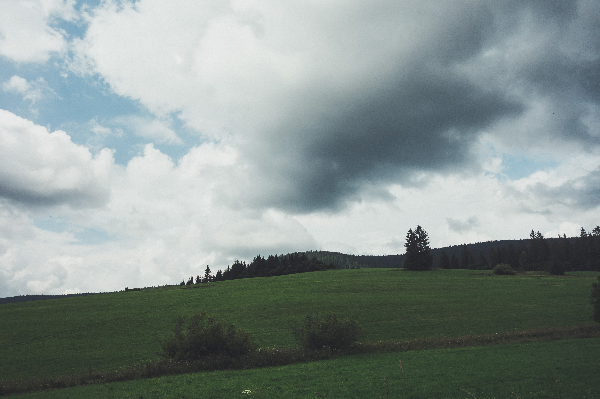
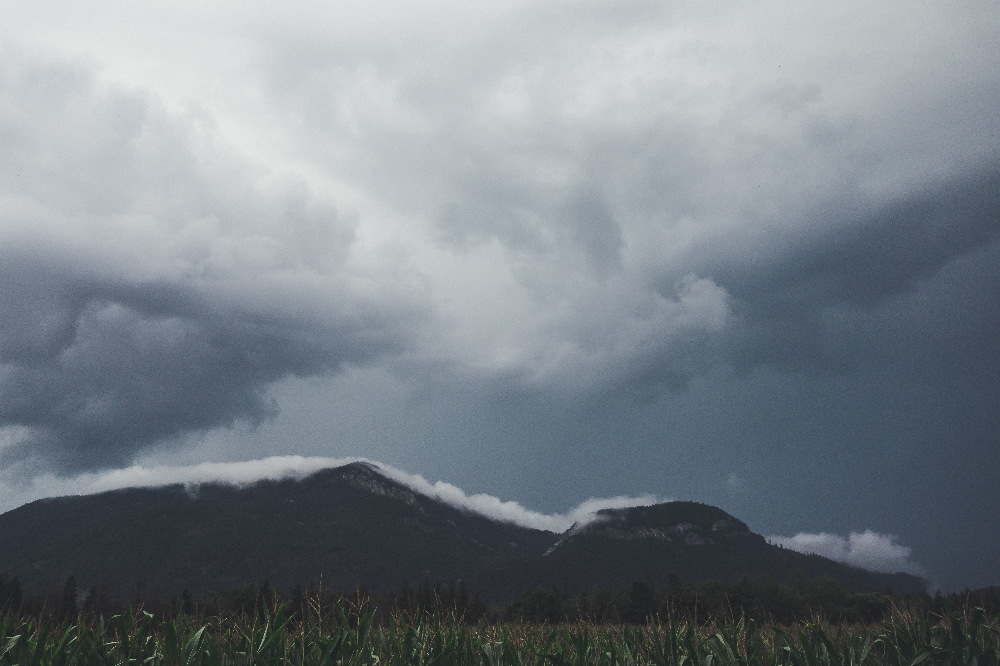

**Back in the Tatra business**

The sight of dust and mud on our bikes are reminiscent of yesterday’s struggles. Today is a 'rest day' which means we’ve got plenty of time to wash our bikes in the morning and head off to Slovakia. 

<image-zoom></image-zoom>

We turn our backs on Tatras and head over the hills towards the lunch stop at Chocholow village. Chochołów is a village comprised almost exclusively of the heritage Polish wooden houses built by the Góral highlanders. From here it is only a couple of kilometres and we are back in Slovakia after 24 hours spent in Poland. 

<image-zoom caption="channeling the inner derp hard"></image-zoom>

Our destination is a village close to Liptovská Mara reservoir. In our way stands a beautiful mountain pass from Huty village which crosses the Tatra mountains. The road to Huty leads through an <marker-link lat='49.313011' lng='19.744723' label='A' zoom='13'>alpine valley</marker-link> along the river Oravica. We arrive only a few days after big floods and all of the bridges are destroyed and replaced temporarily so there is a lot of construction work going on. 

<image-zoom></image-zoom>
<image-zoom></image-zoom>

<image-zoom></image-zoom>

<image-zoom></image-zoom>
<image-zoom></image-zoom>

When we leave the valley our worst predictions of the big storm above the mountain pass are confirmed as we can see the dark clouds hitting the peaks. We stop in <marker-link lat='49.260406' lng='19.615362' label='B' zoom='16'>Zuberec</marker-link> village to put on the shoe covers, rain jackets and lights as the rain is so heavy that there is very little visibility. As we are gaining metres up the climb in the heavy rain we find ourselves laughing. It is an experience that will stay with us but at the same time, we are a little sad not to be able to share it with you as our camera would definitely break down if we shot in this storm. 

<image-zoom></image-zoom>

As we hit the descend I’m really glad I’m running disc brakes on my all road machine. As for Eva, she is much better descender than I am but at times she struggles to clean her rims of the water to engage her braking power as the whole road turns into a creek.  Once hit the bottom we stop for a second to have a look at the storm from a different angle. Completely wet I’m shivering to much of Eva’s amusement, but the home for the night is really close so Eva tells me to toughen up and ride on for a little longer. 

<image-zoom></image-zoom>

# Day three stories

If you've come this far reading, there are <a href="https://www.instagram.com/stories/highlights/17942420491083674/">highlights and short fragments of the day one</a> on our <a href="https://www.instagram.com/coupleoftitans/">CoT instagram</a>

or continue reading about <a href="/rides/around-tatras-4">Around Tatras Day Four</a>.