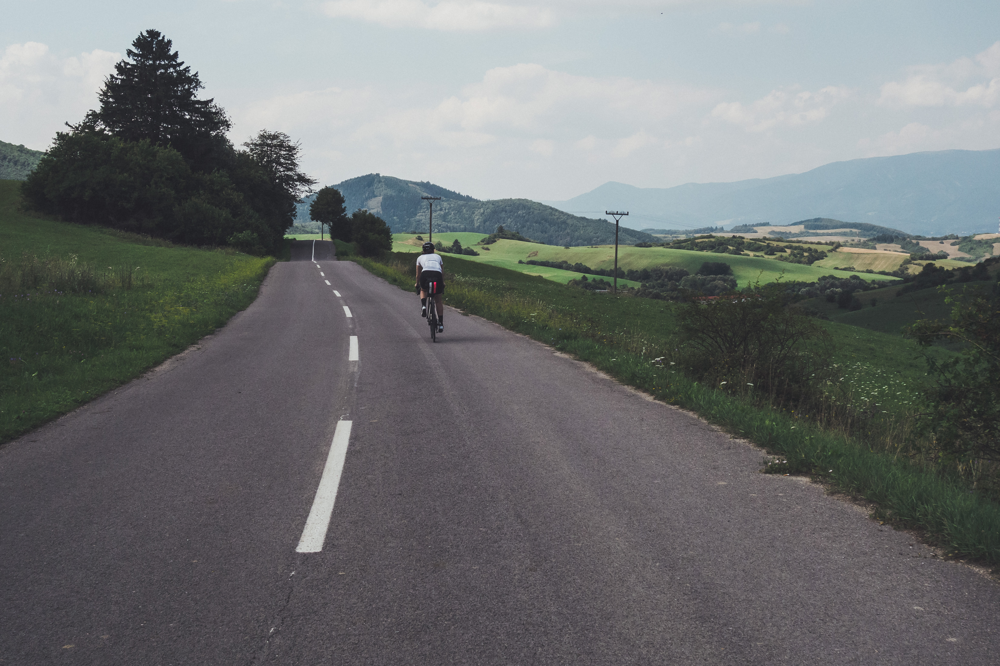
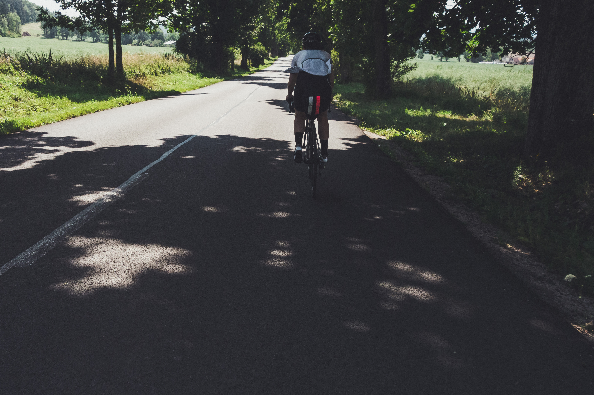

Today is hot, like seriously hot above 30 degrees Celsius in the shadow hot. I’m sure this is probably the toughest day so far. Not because of the parcours but it is going to be a mental fight to ride most of the day in the heat on rolling hills along the Veľká Fatra mountain range. 

<image-zoom></image-zoom>

**Survived**

Morning is chilly but that is only thanks to Liptovská Mara reservoir and as we get to Ružomberok the temperatures rise. Next up is a 25km long stretch on a dangerous main road. The road is known to be hazardous even for the drivers but we really have no other choice but to take it. Of course, we annoy some of the drivers and get some middle fingers. I feel like this is a TT for survival as we power through the valley. Both Eva and I agree that this is the only shitty part of the trip which means we can not complain too much in the end.  

<image-zoom></image-zoom>

**Rolling hills**

The contrast between that valley and the next part of the road is what I was trying to achieve when planning the route. As it is only a few minutes since we were in the huge traffic we can't help but keep looking over our shoulders as we are riding side by side so we can finally chat. But no cars arrive, in next 10km we barely meet anyone and the villages seem died down as the younger generations move out and into the cities. 

<image-zoom></image-zoom>

Finally, we get a chance to hide in the shadows of Kantorská valley. The <marker-link lat='49.054731' lng='19.019115' label='A' zoom='16'>Sklabinský castle</marker-link> or what is left of it lies nearby so if you ever find yourself in the area go have a look. It stands up on the hill watching over the area and you will have to hike a bike for a bit.  

<image-zoom></image-zoom>

The terrain on the mountain foothills is completely open and the steep rolling hills which grades sometimes rise over 15% are slowly wearing us down. Eva hates riding long stretches in the heat of the summer and even though I'm a little more okay with it I find myself wanting to be somewhere else. We stop to refill water, eat some snacks and drink some Cola. 10 minutes later, Eva finds out she left one of her bidons behind but we are too tired to go back. 

<image-zoom></image-zoom>

We both feel relieved that we slew the rolling hills and are onto the one final climb of the adventure. The mountain pass Šturec that crosses Veľká Fatra mountain range and brings us to the foothills of Low Tatras. There are two ways to get to Šturec pass, one flat with traffic or one painful but quiet. Of course we choose to ride the lesser on through picturesque <marker-link lat='48.847902' lng='18.903650' label='B' zoom='16'>Čremošné</marker-link> village with inclines up to 17%. It also means we prolonged the final climb to 14km. Šturec itself is a steady climb with an average of 4% incline. Once we find our tempo it is a sweet ride to the top with temperatures dropping by a few degrees and a little breeze. Šturec downhill can be much fun but we got stuck behind a truck with no way to overtake it. Our chance to bomb it down was taken from us as we spent much of the time on the brakes.

<image-zoom></image-zoom>
<image-zoom></image-zoom>

<image-zoom caption="Čremošné village"></image-zoom>

**Banská Bystrica**

Specialty coffee, fancy lemonades and burgers are the sign of civilization and all we were looking forward to in the last kilometres. We arrive in Banská Bystrica with time to spare before taking the train back to Zvolen so we use it to fill ourselves. If you are a fan of all mentioned above and by any chance find yourself in <marker-link lat='48.735079' lng='19.145387' label='C' zoom='10'>Banská Bystrica</marker-link> check out <a href="https://www.instagram.com/leroybar/">Leroy bar & coffee</a>.

<image-zoom caption="good coffee!"></image-zoom>

Once we arrive at my parent's place it is only my parent's pets which are waiting for us. Confirming that you can always count on them when you need some love and they won't talk back even when unimpressed.

<image-zoom></image-zoom>
<image-zoom></image-zoom>

# Day four stories

If you've come this far reading, there are <a href="https://www.instagram.com/stories/highlights/17933339866155329/">highlights and short fragments of the day one</a> on our <a href="https://www.instagram.com/coupleoftitans/">CoT instagram</a>