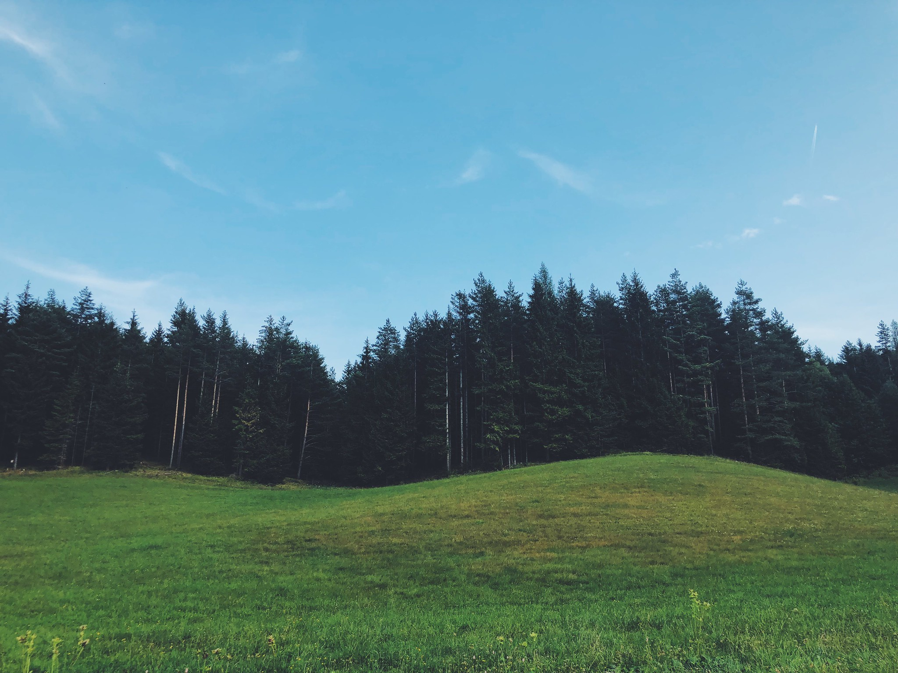
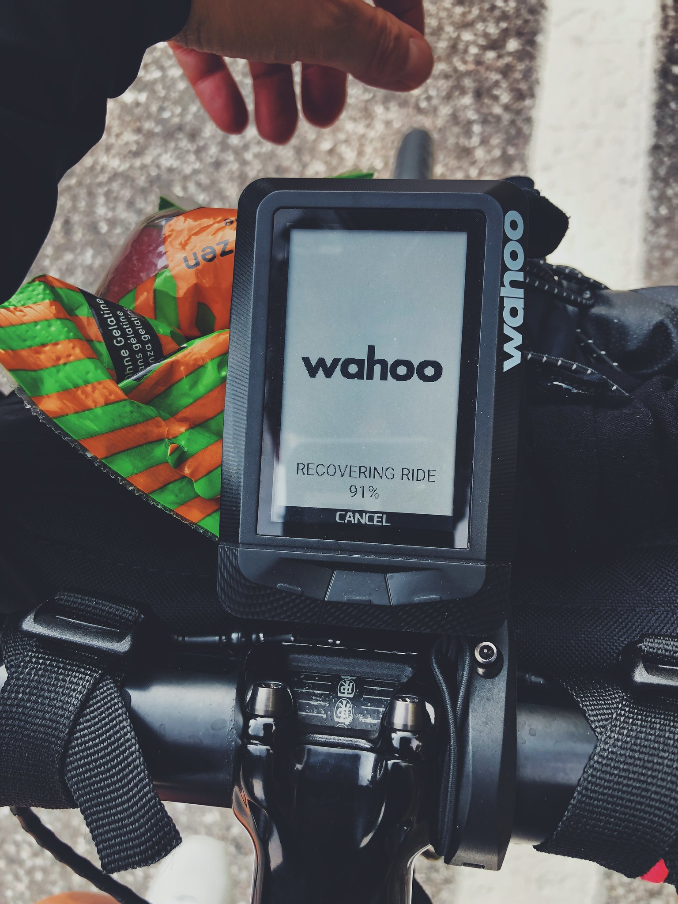
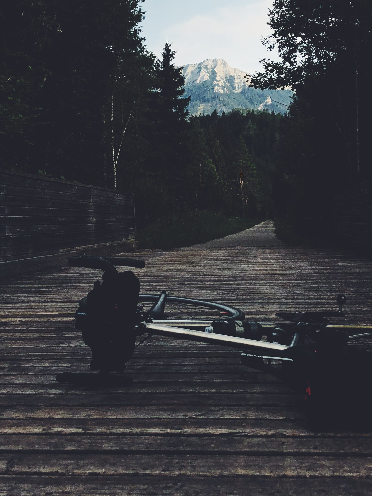
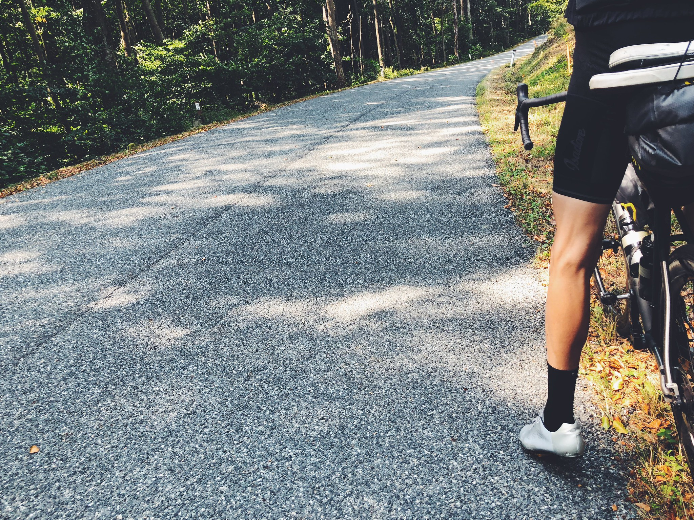
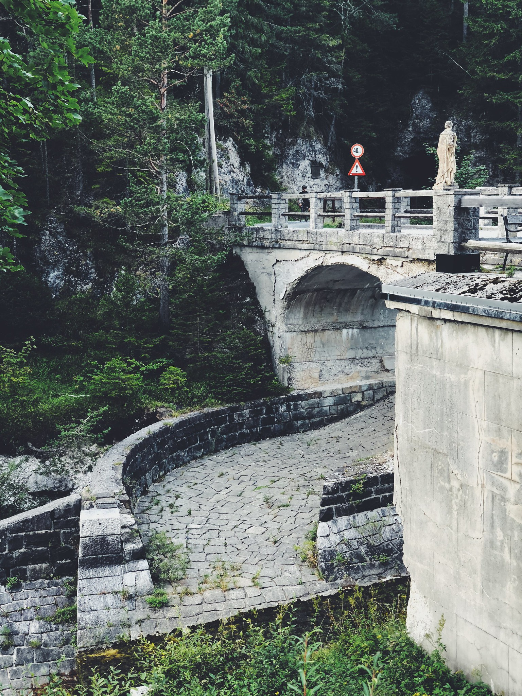
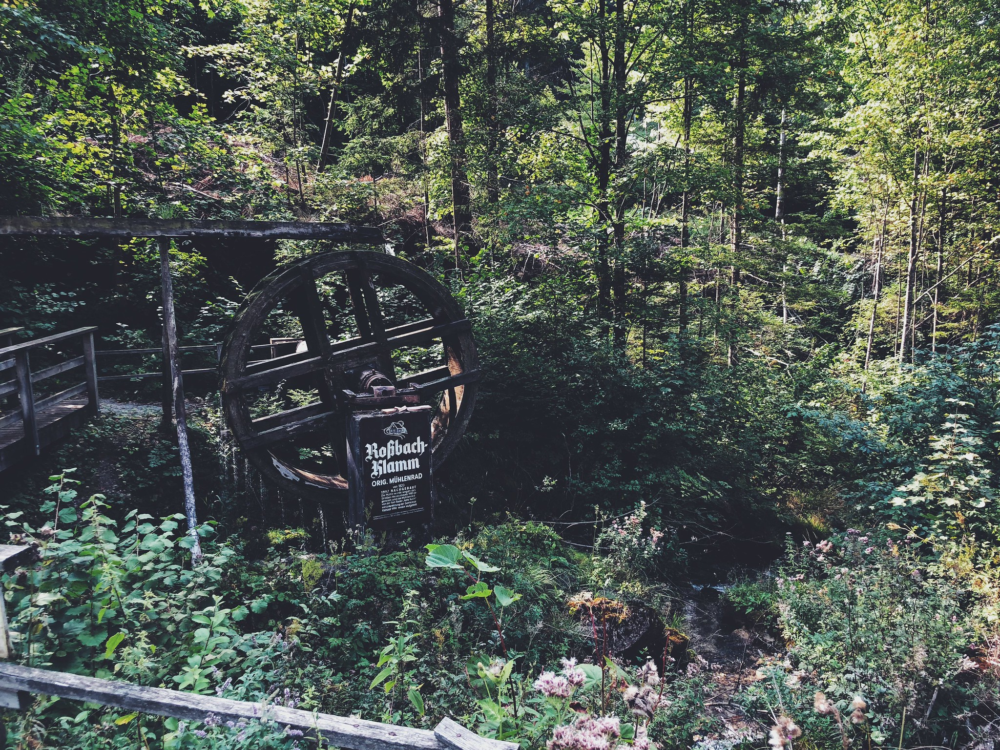
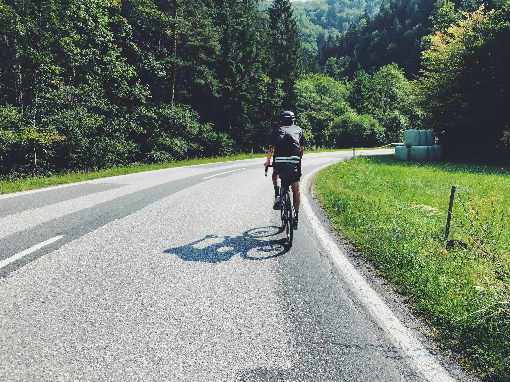
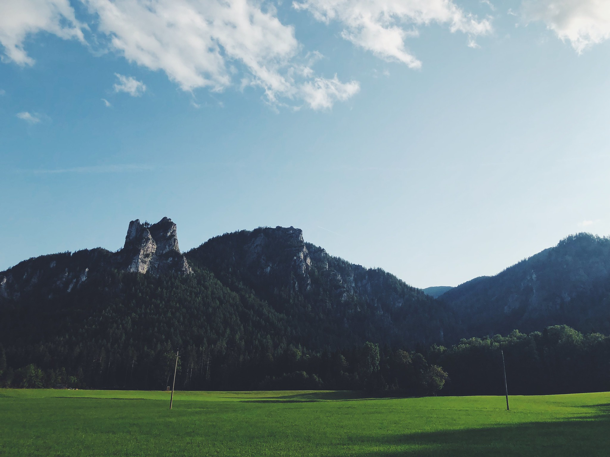

You don’ really know what you can ride until you try. 

That’s how we feel about our bikepacking and rando routes. This is second bikepacking in our lives and we are trying something harder than the previous ride around the Tatras. We are still staying at apartments for each night of the trip but I’m sure hobo life will come one day even for us.

Salzburg is not so far away from Bratislava so to make the ride a touch longer and substantially harder you gotta take it over the Alps. Also, riding flatlands along the river Danube which would be the most straightforward route is not really appealing to us. We kind of knew what we were getting into as we already rode in some parts along our route but never with bike bags attached to our bikes. 

<image-zoom></image-zoom>

**Slow beginnings**

Starting in Vienna because we wanted to skip the route we’ve ridden many times and ultimately save some legs for days to come. As we ride through the thick of traffic in the morning it feels pretty surreal that as we suddenly take one right-hand turn from the main road, the city changes into a village. It’s definitely one of those bigger cities that are a very good starting point for rides.

<marker-link lat='48.183715' lng='15.998370' label='A' zoom='11'>Wienerwald</marker-link> is the first bit of nature as we leave Vienna and it’s a hell of a beautiful place. It feels like the Autumn has already started as the fallen leaves fly around us. We take it pretty slow as we have plenty of time to ride 140k planned for the day. 

The first 60k pretty much consists of rolling hills and sudden changes of temperature as we leave the forest and enter green fields. That scenario repeats itself until we reach the bottom of Alps. We are just a couple of hours from the hustle of the city and already close to entering the mightiest mountain range in Europe. <a href="https://www.instagram.com/explore/tags/viennasucksforcycling">#viennasucksforcycling</a> indeed.

<image-zoom></image-zoom>
<image-zoom></image-zoom>

**Among the giants**

And it’s uphill from now on. We don’t really know how fast to ride and whether we could push a little because we still have two more days ahead full of climbing. The ignorance feels good and we focus on the present moment and the fact that we still have enough time until the sun goes down. For some reason, we left our front lights at home so we have some time constraints. Next time we will definitely bring them. So far we’ve been lucky with weather and mechanicals they were not needed but you never know… 

<image-zoom></image-zoom>

The real highlight of a day is a small valley through a village called <marker-link lat='47.809615' lng='15.372320' label='B' zoom='12'>Wallstern</marker-link>. It’s a detour on our way to Mariazell but with some time on our hands, we decide to step into unknown and take it. Immediately as we enter the side road the nature changes. We are surrounded by tall rock walls and small river as the valley is opening up in front of us. After a while, we arrive at a small dam. Seems like it hasn’t been used for a long time as nature took over the concrete. The sun is coming down, so, unfortunately, we don’t have much more time to savor the moment. 

<image-zoom></image-zoom>

<image-zoom></image-zoom>

What comes down must go up. We tackle a few more switchbacks of the day and get to our final destination. The day ends with pizza and beer. Next day means a new beginning. Tomorrow we start from zero but it should be an epic day if we are to trust google earth. 

<image-zoom></image-zoom>
<image-zoom></image-zoom>

<video src="2018-08-29 17.09.02.MP4" type="mp4" controls></video>

