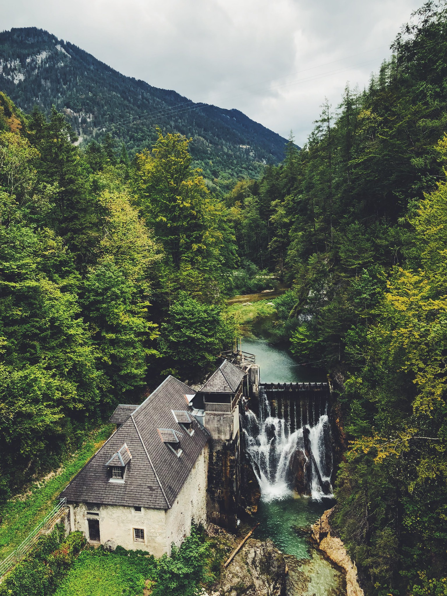

We planned our second day to be a touch shorter with 130k to ride and gaining around 1300m in elevation but the weather forecast looked torrid and we had to push the pedals stronger while keeping coffee time to a minimum.

After a few km on the busier main road, we arrived at the <marker-link lat='47.741543' lng='15.308582' label='A' zoom='11'>road 24</marker-link> that would take us to the border of a Valhalla. 

<image-zoom></image-zoom>

Some have to choose borders made from concrete, some from steel and some have it form nature itself for them in the shape of great mountains. <marker-link lat='47.664644' lng='14.985492' label='B' zoom='11'>Wildalpen</marker-link> is famous mainly for rafting, kayaking, canoeing thanks to its emerald green waters of river Salza. This river supplies half of the freshwater in Vienna. A journey of 36 hours, until the drop, shoots out of the II. Vienna high-water pipeline. We made this same route the other way in about 24h with comfortable 8h sleep in. So we are literally more than twice as fast as the Wildalpen’s water. 

<image-zoom></image-zoom>

**Giant left, water right**

As much as this area is known for water sports, we fully recommend it to cyclists too. Although there is just one road through the valley it is totally breathtaking every meter of the road and you will have to be very unlucky to meet many drivers passing by. The Salza river is one of the last unspoiled natural rivers in Europe which means the whole valley seems almost untouched by humans. If you by any chance have more time riding this area be sure to check out Hinterwildalpen and visit the most beautiful end of the world you’ve ever seen. At least that’s what the locals say it looks like. We, unfortunately, didn’t have that time and had to keep going down the valley. 

<image-zoom></image-zoom>

During the summer it’s good to keep in mind that it’s very quiet, therefore most of the restaurants are closed for the whole season. We were lucky to find one and munch on traditional Austrian potato dumplings. 

<image-zoom></image-zoom>

During the whole ride, we had the bad weather forecast on our minds. Bikepacking for hours in rain is never fun and even less so if that’s in the Alps where storms can get pretty violent. Unfortunately with about 60k to go it dawned on us that we will have to change into our rain gear ASAP or risk getting wet in the middle of nowhere. It was a good call and in a few minutes the heavy rain started and there was nothing to do but ride as our accommodation was still 55k to go and two mountain passes away. We stopped briefly in <marker-link lat='47.723987' lng='14.650795' label='C' zoom='11'>Altenmarkt by Sankt Gallen</marker-link> but there wasn’t any sign of the rain stopping so we had to push forward. 

<image-zoom></image-zoom>
<image-zoom></image-zoom>

Researching the road that was ahead of us we got confused by Komoot that thought this will be a 30k long stretch of gravel. We were very cautious about it as riding gravel on road slick tires in heavy rain didn’t sound like much of a fun. But to our surprise, it turned out to be an amazing road through another natural gem which is the Kalkalpen Nationalpark or the Limestone Alps. Limestone is an amazing rock to that extent that rivers can form beautiful valleys through it. And that’s exactly what you will get if you take the road through <marker-link lat='47.719311' lng='14.554557' label='D' zoom='11'>Unterlaussa</marker-link>. 

The <a href="https://goo.gl/maps/tgB3WhHi88TC3qa38">Limestone Alps</a> are a vast area with more than 450k of bike trails so if you are in possession of gravel bike or MTB go check it out. It is a beautiful area with one of Austria's largest distinct forest areas - a sea of forest, which has not yet been dissected by public transportation routes and human habitation. 

<image-zoom></image-zoom>

**Only happy when it rains, said Boris never**

On the 100th kilometer, we hit the top of the pass and started a very annoying descent in full rain. At this point, we already did 30k in never-ending rain and the mental side of cycling was starting to kick in. Even though it wasn’t the hardest of the days our legs were not with us anymore and the cold was starting to get under our skin. 

**Beginner mistakes**

We made a big mistake underpacking with only summer gear and some water repellent jackets. We did not expect to endure 4h of heavy rain in 12 degrees after what was the hottest couple of weeks of summer 2018. Beginner mistakes… The rest of the ride was mentally pretty hard. The night started to creep in, the clouds came down on us among the mountains and this combination made it very hard to cling onto some vantage point the distance. The only thing to cling on was the thought of a warm shower and some food at the hotel.

<image-zoom></image-zoom>

<image-zoom></image-zoom>

**Velotoze covers are not working with skinny people**

We made it to Hinterstoder just in time before the sunset and relieved that the day in the rain was finally over. To get into our beds we only had to pressure the hotel staff to let us keep our wet bikes in our room as their policy was that you can pay for the bike booth to lock it in but if it gets stolen it is none of hotel’s business. That made no sense and after a 10min long argument, they got tired of us and let us keep the bikes inside the room. Persistence of hangry cyclist 1 hotel staff 0.