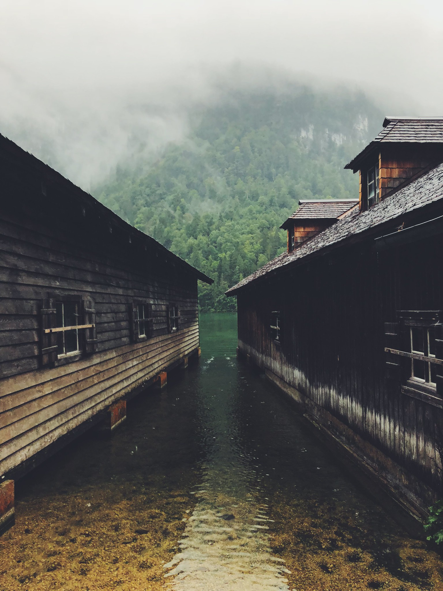

Under the <marker-link lat='47.702025,14.160259' lng='14.160259' label='A' zoom='11'>dead mountains</marker-link>, around the lakes, and into the culture. That is our final day en route to Salzburg.   

<image-zoom></image-zoom>
<image-zoom></image-zoom>

Sometimes bikepacking can be a strange adventure. On the one hand, you see many places from the ideal speed on the bike, you have time to enjoy the moments with your loved ones, friends or yourself. On the other hand, sometimes you wish you could spend more time at some places, take a different route that would take you nowhere and find some peace among the giants. But in the end there is a lot to enjoy about it and the places you discover are always accessible for longer stay in the future. 

During this trip, we didn’t have time to stop for longer periods but looking back at it we managed to dial in the experiences and enjoy most of it. 
It was so good that, if we continued our trip to Tirol, the route would have been a postcard for Austria. But even if we didn’t see Tirol on this trip we were left thrilled by the beauties of Steiermark, Upper Austria, and Salzburg. No rain or fatigue could change anything about the times this country left us in awe of its beauty. 

We found refuge from the pulsating city life and more importantly, a refuge from the city heat. The alpine climate is what we love the most during hot summers in Bratislava. We got what we asked for in milder temperatures and summer rainfall, but that would not stop any cyclist in hers/his tracks. 

<image-zoom></image-zoom>

**Land of lakes**

To rise above <marker-link lat='47.882483' lng='13.544650' label='B' zoom='11'>Attersee</marker-link>, the biggest of the lakes in the area you must pass a beautiful town of <marker-link lat='47.919507' lng='13.797381' label='C' zoom='11'>Gmunden</marker-link> near the second biggest lake Traunsee. From Traunsee to top of the <marker-link lat='47.880444' lng='13.636690' label='D' zoom='11'>Grosalm climb</marker-link>, it’s around 15k of mixed climbing, false flats, and short downhills. But grind it to the top, and you will be rewarded with delightful downhill to Attersee. What is usually a lively summer holiday spot is now heaven on earth for those who prefer stillness. Riding around the lakes on a hot day you wouldn’t be alone to think about a dip in their crystal-clear waters. Most likely on another day, we would do the same. 

<image-zoom></image-zoom>

It’s not far away from Attersee to <marker-link lat='47.812433' lng='13.383520' label='E' zoom='11'>Mondsee</marker-link> which means it’s a home run for us. This is where you start to feel and breathe what Salzburgerland is all about. Farmhouses scattered all over the place, connected by roads with spotless tarmac, green hills everywhere and rocky mountains in the background. It’s easy to fall in love with this place even on a rainy day. Salzburg lies in a valley, so unless you are riding from Bavaria, you have to climb over some rolling hills and then descend into the city. I still don’t understand how we managed to find what is probably the only main road around the city, without a cycle path. So for a moment, we were thrown into a reality of heavy Friday afternoon traffic. Visibility turned zero by the constant rain and woods all around us. We soon found ourselves in a misty forest, then misty hills and, although we couldn’t see Salzburg it was equally beautiful, as whatever we could have seen on a sunny day. 

This feeling of being lost, not able to see your finish line is to me the essence of bikepacking. You go out with a route in mind but knowing that anything that comes between the starting point and the end is a mystery you are about to uncover. Sometimes you uncover all of it. Other times nature will conceal some parts so you leave the place with a hidden need to come back again and see it in in a different state. And come back we did, already twice and hopefully will come back many more times.

**In Salzburg**

The rain continued until the end of the weekend, so we got to explore the city itself rather than riding our bikes. I believe it was a good thing, because we found some time to chill and sip on the divine elixir that is coffee. Salzburg has a lot to offer, but nothing really was that important to us as trying a specialty coffee. Ok, maybe the food after riding for 3 days was more important, but coffee was much better. If you are in Salzburg and desperately in need of good coffee check out Kaffe Alchemie. You won’t be disappointed. 

<image-zoom></image-zoom>
<image-zoom></image-zoom>

Salzburg is the home of Red Bull, so there are some places owned by the company that are good to explore. Our friend, for example, showed us around at Hangar 7. They have a permanent exhibition of Red Bull planes plus other Red Bull owned formula cars, motorcycles and more. I’m not such a big fan of aviation, but the pieces that are on display are true classics so it’s worth it. But what is maybe even cooler is the architecture of the hangar. It’s not a usual box that you would expect, but rather a beautiful glass structure. The sky seemingly right above the airplanes gives the exhibition another dimension.

<image-zoom></image-zoom>

From there we drove down to Germany to hike a little around <marker-link lat='47.553814' lng='12.976367' label='F' zoom='11'>Königsee</marker-link>. The lake sits right between the mountains so it’s a cool sight. On this rainy day, it had a different vibe because of the fog that was lying just above the lake, hiding the mountains from us. But beware, during most of the summer it’s crazy busy so if you’re not a fan of crowds check it out during the offseason or on a foggy day as we did. 

<image-zoom></image-zoom>

There is much, much more to Salzburg than we did so do some research and go explore this cycling Disneyland. Read about tribute to <a href="/rides/these-assholes">friendly folks in Salzburg</a> we met.