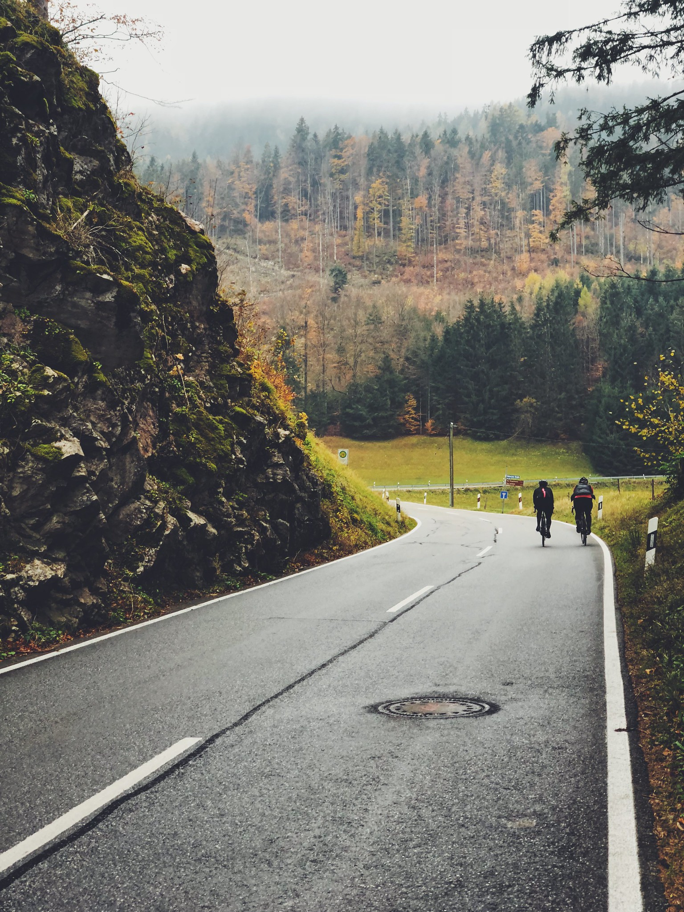

**An ode to the people we meet**

Some years back Instagram used to funnel creativity for many, many people around the world including two of us. Now it funnels bullshit for many more people but this post is about how it still can do good, in hands of the right people. 

And in this case, these good peeps are the ‘infamous’ #salzburgerassholes. 

Thanks to a never-ending supply of IG content by <a href="https://www.instagram.com/jbraynard/">John Braynard</a> we fell in love with Salzburg and really wanted to explore the area. 

So in 2018, we went to Salzburg twice, first time on our bikepacking trip from Vienna and the second time to meet the people we couldn’t meet the first time due to terrible weather. It’s not like it didn’t rain this time around again but we were determined to do some riding and in the end, the weather gods were sorta merciful. 

You will be able to read more about our bikepacking trip soon. 

Upon our arrival, John met with us in the city and decided to guide us to our accommodation at our friend's place. The visit started as it ended the last time we were in Salzburg. Rain… If it wasn’t for John, the ride would have been much worse as it got dark real quick and therefore it was hard to navigate around for us alone. 

<image-zoom caption="specialty coffee spot in Sazlburg Kaffee Alchemie"></image-zoom>

**Biehler ride**

For a first day, Eva and I split for two different rides. I went riding with the assholes to an event called Biehler beat the elements but #biehlernevercame and the ride was cursed with flat tires so I’m not gonna talk much about it.

<image-zoom></image-zoom>
<image-zoom></image-zoom>

<image-zoom></image-zoom>
<image-zoom></image-zoom>

<image-zoom></image-zoom>
<image-zoom></image-zoom>

**Why catch flats when you can ride with girls?**

Eva did much calmer ride with <a href="https://www.instagram.com/brigs222/">Brigitte</a> & a <a href="https://www.instagram.com/caro_klara/">Clara</a> towards Wunderwald and <marker-link lat='47.605469' lng='12.856413' label='A' zoom='14'>Hintersee</marker-link>

<image-zoom caption="Wunderwald is magic in misty weather"></image-zoom>

<image-zoom></image-zoom>
<image-zoom></image-zoom>

Speaking of flat tires, on our way to a place we called home for the weekend Eva got one too and this one was not to be fixed. John jumped to the rescue once again and gave us a ride home. More superstitious people would probably think Salzburg is a cursed town, but we are satan’s children and we will not be stopped. 🐐 

**Gaisberg**

The second day was that kind of a ride that we came here for. The kind of a ride when you meet people who don’t annoy you after 15min in the saddle and you get to chat shit together and share the road with. A ride which success is counted in the number of pictures taken, the number of stops to pet cows and goats, good coffee and last but not least the quality of a video made by John. 😎 

<image-zoom></image-zoom>

<image-zoom></image-zoom>
<image-zoom></image-zoom>

The boys and girls showed us that Salzburg really is a cycling version of a Disney amusement park: <marker-link lat='47.636754' lng='13.128087' label='B' zoom='16'>sweet rolling hills</marker-link>, <marker-link lat='47.661974' lng='13.156336' label='C' zoom='16'>waterfalls</marker-link>, cycling paths everywhere, killer climbs in each direction, fun gravel roads, good coffee at <a href="https://www.instagram.com/kaffeealchemie/">Kaffee Alchemie</a>, red bull cola everywhere and whatever the fuck else you can imagine. 

<image-zoom></image-zoom>

<image-zoom></image-zoom>
<image-zoom></image-zoom>

<image-zoom></image-zoom>

We ended the ride up on <marker-link lat='47.803160' lng='13.110303' label='D' zoom='16'>Gaisberg</marker-link> and waited for the most beautiful sunset you will ever see. Fuck yes, Salzburg is exactly like we imagined. 

<image-zoom caption="Gaisberg"></image-zoom>

<image-zoom></image-zoom>
<image-zoom></image-zoom>

<image-zoom caption="Gaisberg"></image-zoom>

# Special thanks

But we believe the Salzburg we experienced wouldn’t be the same without the people who spent some good time with us. So big thank you goes to <a href="https://www.instagram.com/jbraynard/">John Braynard</a> and <a href="https://www.instagram.com/brigs222/">Brigitte</a> for helping us out and the dinner (so many pizzas are on us when we see ech other again!) <a href="https://www.instagram.com/pipdms/">Philipp Doms</a>, <a href="https://www.instagram.com/_piwio_/">Sasha</a>, <a href="https://www.instagram.com/radlbob/">Bob</a> for being cute guides and <a href="https://www.instagram.com/youdropfirst">Filip</a> for letting us crash at your place. 

Till next time… 🍻 