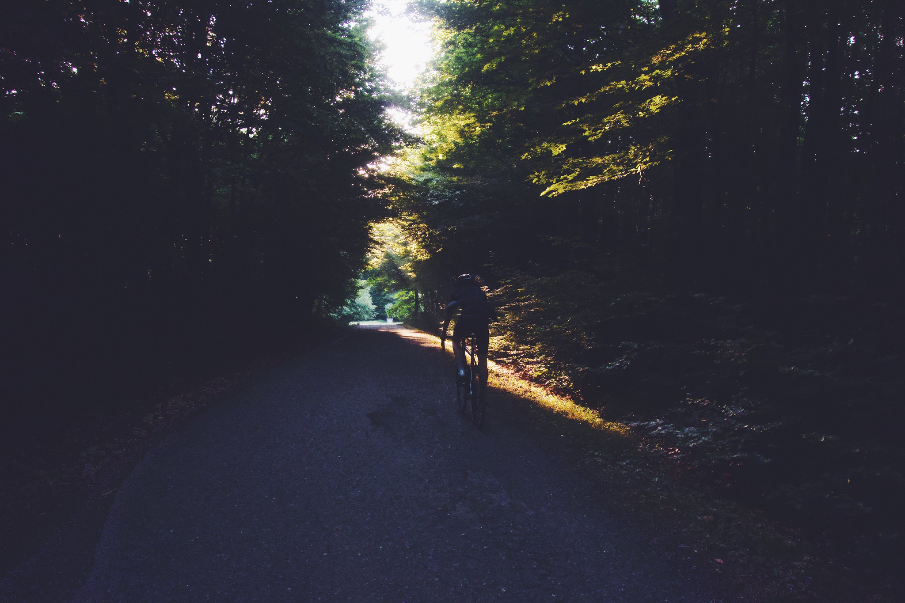
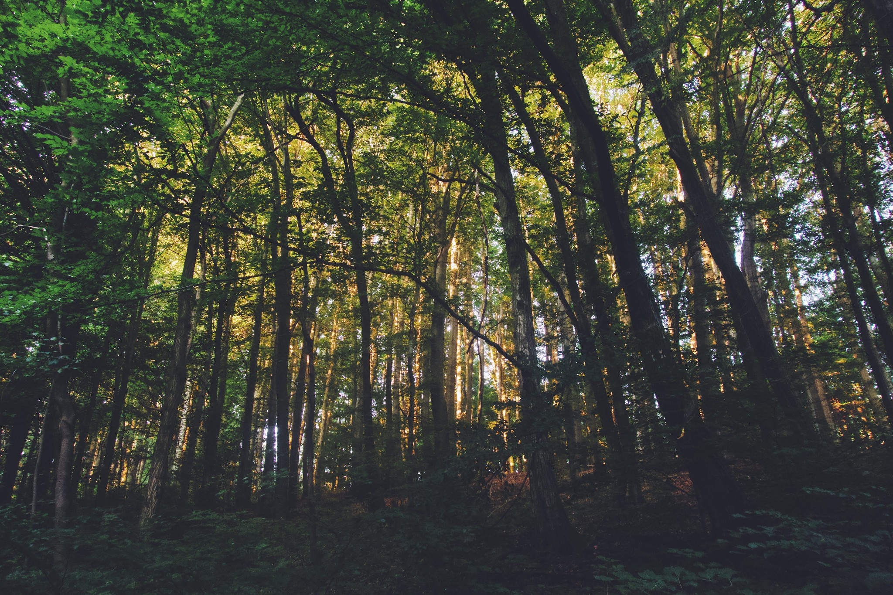
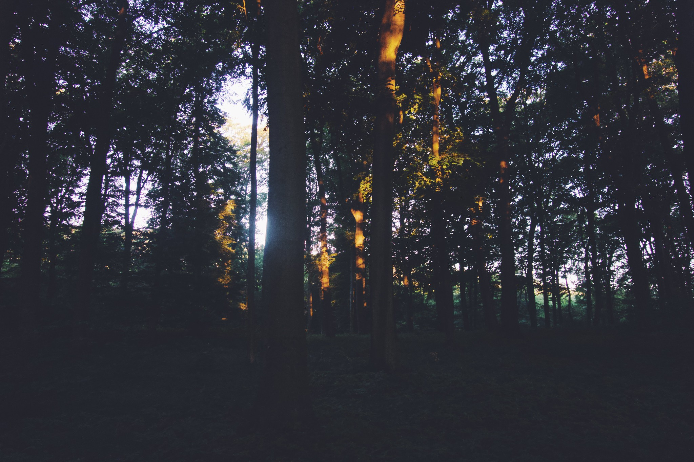
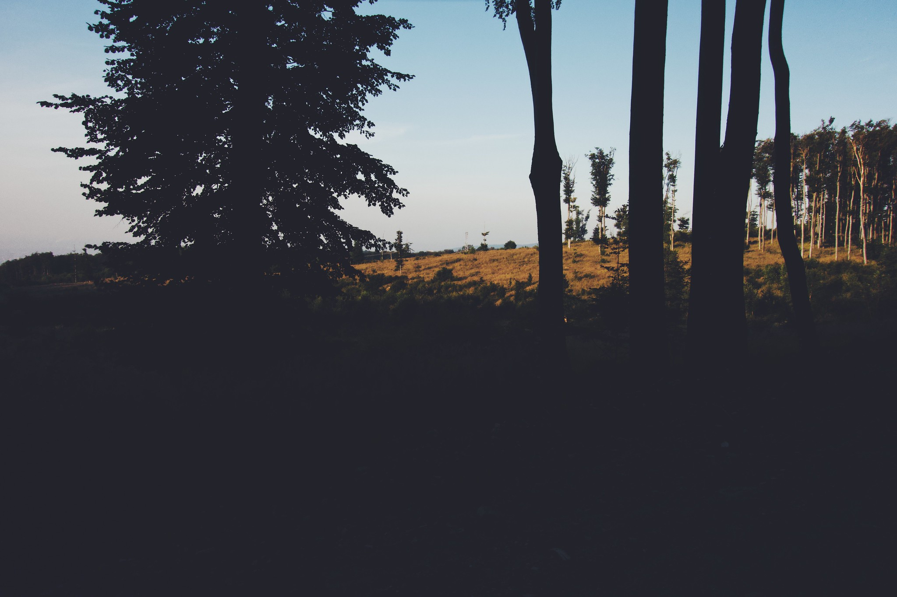
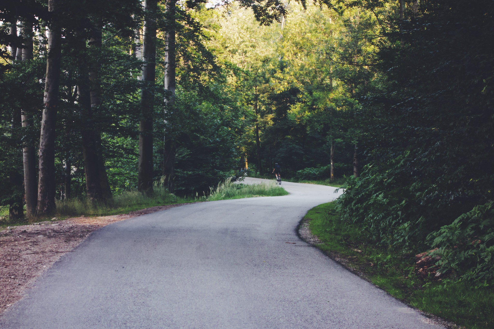
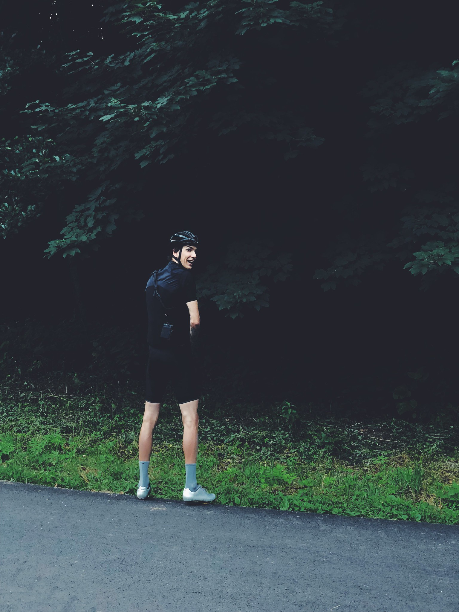

**Home hood**

We are lucky to have a lush forest 15 minutes from the Bratislava city center, closed to the cars thus without traffic. Trees, providing shadow and cool breeze. This is a throwback to solstice of year 2018 and a tribute to Little Carpathians ridge. Hood that created and nurtured my passion for bikes.

We woke up early to catch the sunrise on the hill ridge, just before work.

<image-zoom></image-zoom>

Road quality can be within central european 'not great, not terrible'. But with new tarmac layers each year brings us new yay, wheee moments on the same route.

<image-zoom caption="lush dense green in the valley"></image-zoom>

You begin climbing easy up through a fresh valley with dense vegetation.

<image-zoom caption="late sunrise on the top of the hill"></image-zoom>
<image-zoom caption="around the corner of Biely Kriz"></image-zoom>

To peek over both sides of the country from the top in warm morning light.

<image-zoom caption="ridge road towards Limbach"></image-zoom>

Looking forward to set up a tradition and do the early morning ride on the longest day of the year again in 2019.

<image-zoom></image-zoom>

Stay hydrated, friends. When you pee a lot, there is no time for drama.