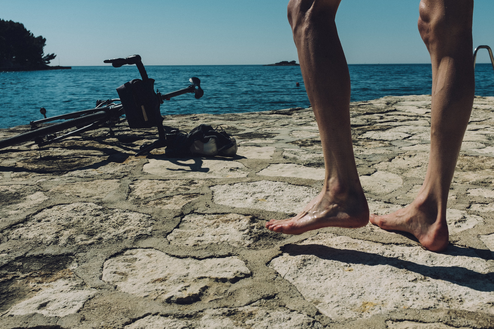
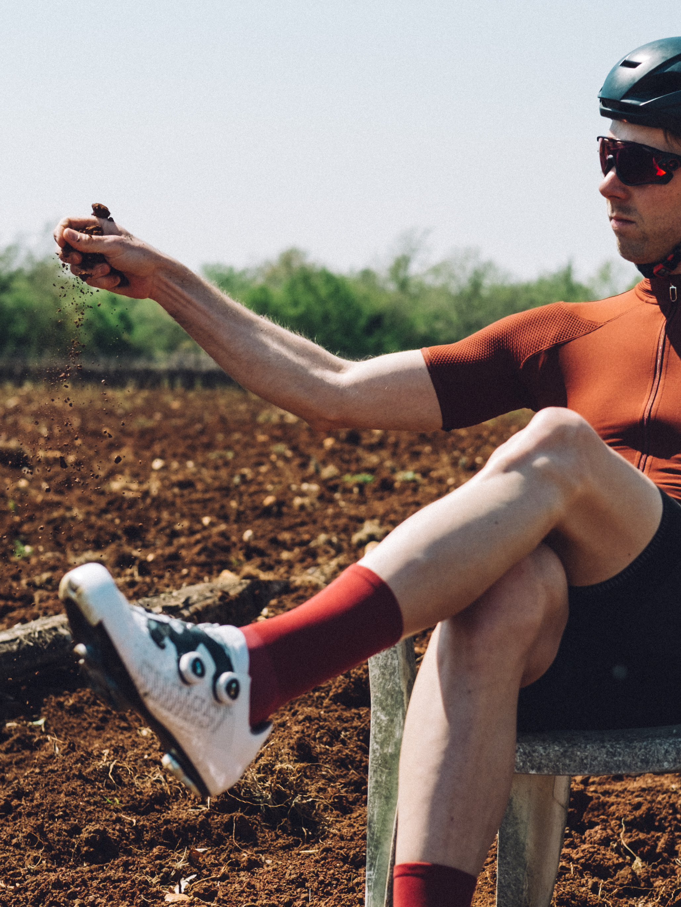

We, the core of the group called the ***Lusco Fusco Pilgrims*** were brought together over the past years to perform the art of <a href="https://www.instagram.com/explore/tags/ridelikeapilgrim/">#ridelikeapilgrimacross</a> (sofar) the European continent. This is another volume of our Spring voyages. 

<image-zoom></image-zoom>
<image-zoom></image-zoom>
<image-zoom></image-zoom>
<image-zoom></image-zoom>

In spring we too try to wake up our legs from hibernation. To do so, we choose to travel to warmer climates. This year the choice became Croatia. 

<image-zoom></image-zoom>

To be precise, the destination was northern Croatia, also called Istria and its city of Poreč. It is a country close to our heart as some of us used to spend here holiday times during our childhood. It is a country where we can speak Slovak and locals can speak Croatian and we will easily understand each other. It is a country of wine, truffles, fresh seafood, and Italian food. And as if this combination wasn't enough, it is relatively cheap compared to other European destinations with similar offerings. Cycling wise, there are plentiful small hills and quiet roads. Overall, it checks all the boxes on the bike Pilgrim’s list.

<image-zoom></image-zoom>

Practically, just be aware that most bike shops around here are more accustomed to mountain bikes than road bikes. So if you not only waking up your legs from hibernation but also your bike, make sure you do all the necessary gear refreshments at home or carry the toolkit and a few most important items with you. Because getting things done for road bikes in these parts can be difficult. Thank YouTube vlogger who recorded a trick to open a chain quick link with old brake cable instead of pliers. Always evolve.

<image-zoom></image-zoom>
<image-zoom></image-zoom>
<image-zoom></image-zoom>

<image-zoom></image-zoom>

Usually, this text would be followed by a factual description of the ride. This time let’s talk about how did we come about being Lusco Fusco Pilgrims. Since all 3 of us started riding we believed it should be about experiences and good times. That is in stark contrast with what is or used to be, common in the (hobby) cycling community where cyclists focus on suffering, comparing achievements and epicness.

<image-zoom></image-zoom>
<image-zoom></image-zoom>
<image-zoom></image-zoom>
<image-zoom></image-zoom>

The much-talked-about epicness never meant much to us, so we naturally inclined to rawness. This means that it’s not so much about where you do something, but above all about doing something, how you do it and with whom. We don’t strive for a long day outdoors adventures, as our professions are another integral part of our lives. So the fragments on bike time are spontaneous micro-adventures feeding the fundamental joy of cycling, why we ride. Likeminded people often end up together, this way our triumvirate was born. You could call it a natural selection. <a href="https://www.instagram.com/explore/tags/fundamentaljoyofcycling/">#fundamentaljoyofcycling</a>

***How to #ridelikeapilgrim***

<image-zoom caption="the coffee time during a ride should be at least the same as ride time"></image-zoom>
<image-zoom caption="shorter is better. long is also good"></image-zoom>

<image-zoom caption="stop to take pictures anytime something catches your eye"></image-zoom>
<image-zoom caption="do a choo-choo train’ if you’re not alone"></image-zoom>

<image-zoom caption="if you can plan the route with good food stops, do it"></image-zoom>

<image-zoom caption="explore what’s around you before venturing far away"></image-zoom>

<image-zoom caption="use your gut feeling to alternate your routes on the go"></image-zoom>

Riding a bike is an all-encompassing lifestyle and this is how we roll. And seeing this becoming a trend feels good as we might come along more and more bike Pilgrims on our adventures. 

<image-zoom></image-zoom>
<image-zoom></image-zoom>
<image-zoom></image-zoom>
<image-zoom></image-zoom>

